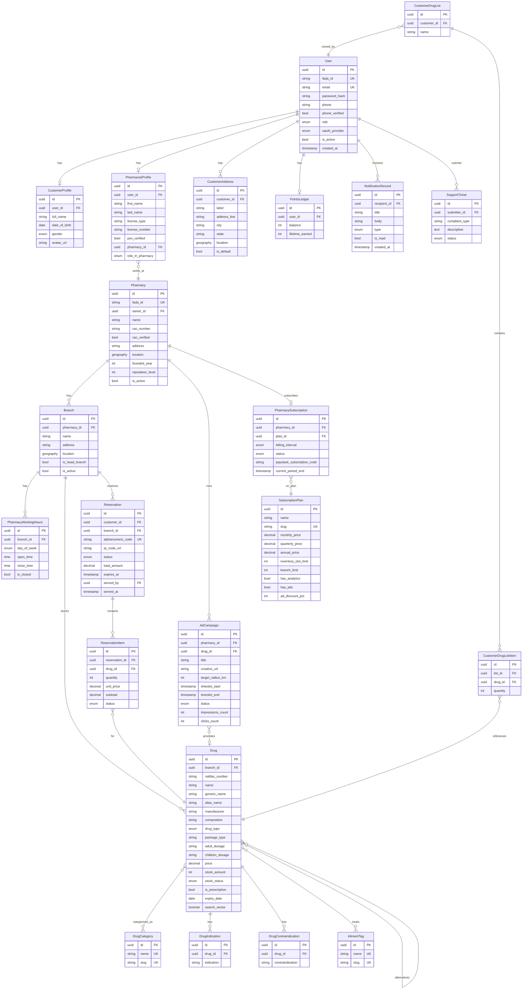

# FADA — Entity Relationship Diagram

```mermaid
erDiagram
    User {
        uuid id PK
        string fada_id UK
        string email UK
        string password_hash
        string phone
        bool phone_verified
        enum role
        enum oauth_provider
        bool is_active
        timestamp created_at
    }

    CustomerProfile {
        uuid id PK
        uuid user_id FK
        string full_name
        date date_of_birth
        enum gender
        string avatar_url
    }

    PharmacistProfile {
        uuid id PK
        uuid user_id FK
        string first_name
        string last_name
        string license_type
        string license_number
        bool pcn_verified
        uuid pharmacy_id FK
        enum role_in_pharmacy
    }

    CustomerAddress {
        uuid id PK
        uuid customer_id FK
        string label
        string address_line
        string city
        string state
        geography location
        bool is_default
    }

    Pharmacy {
        uuid id PK
        string fada_id UK
        uuid owner_id FK
        string name
        string cac_number
        bool cac_verified
        string address
        geography location
        int founded_year
        int reputation_level
        bool is_active
    }

    Branch {
        uuid id PK
        uuid pharmacy_id FK
        string name
        string address
        geography location
        bool is_head_branch
        bool is_active
    }

    PharmacyWorkingHours {
        uuid id PK
        uuid branch_id FK
        enum day_of_week
        time open_time
        time close_time
        bool is_closed
    }

    Drug {
        uuid id PK
        uuid branch_id FK
        string nafdac_number
        string name
        string generic_name
        string alias_name
        string manufacturer
        string composition
        enum drug_type
        string package_type
        string adult_dosage
        string children_dosage
        decimal price
        int stock_amount
        enum stock_status
        bool is_prescription
        date expiry_date
        tsvector search_vector
    }

    DrugCategory {
        uuid id PK
        string name UK
        string slug UK
    }

    DrugIndication {
        uuid id PK
        uuid drug_id FK
        string indication
    }

    DrugContraindication {
        uuid id PK
        uuid drug_id FK
        string contraindication
    }

    AilmentTag {
        uuid id PK
        string name UK
        string slug UK
    }

    Reservation {
        uuid id PK
        uuid customer_id FK
        uuid branch_id FK
        string alphanumeric_code UK
        string qr_code_url
        enum status
        decimal total_amount
        timestamp expires_at
        uuid served_by FK
        timestamp served_at
    }

    ReservationItem {
        uuid id PK
        uuid reservation_id FK
        uuid drug_id FK
        int quantity
        decimal unit_price
        decimal subtotal
        enum status
    }

    SubscriptionPlan {
        uuid id PK
        string name
        string slug UK
        decimal monthly_price
        decimal quarterly_price
        decimal annual_price
        int inventory_slot_limit
        int branch_limit
        bool has_analytics
        bool has_ads
        int ad_discount_pct
    }

    PharmacySubscription {
        uuid id PK
        uuid pharmacy_id FK
        uuid plan_id FK
        enum billing_interval
        enum status
        string paystack_subscription_code
        timestamp current_period_end
    }

    AdCampaign {
        uuid id PK
        uuid pharmacy_id FK
        uuid drug_id FK
        string title
        string creative_url
        int target_radius_km
        timestamp timeslot_start
        timestamp timeslot_end
        enum status
        int impressions_count
        int clicks_count
    }

    PointsLedger {
        uuid id PK
        uuid user_id FK
        int balance
        int lifetime_earned
    }

    CustomerDrugList {
        uuid id PK
        uuid customer_id FK
        string name
    }

    CustomerDrugListItem {
        uuid id PK
        uuid list_id FK
        uuid drug_id FK
        int quantity
    }

    NotificationRecord {
        uuid id PK
        uuid recipient_id FK
        string title
        string body
        enum type
        bool is_read
        timestamp created_at
    }

    SupportTicket {
        uuid id PK
        uuid submitter_id FK
        string complaint_type
        text description
        enum status
    }

    User ||--o| CustomerProfile : has
    User ||--o| PharmacistProfile : has
    User ||--o{ CustomerAddress : has
    User ||--o| PointsLedger : has
    User ||--o{ NotificationRecord : receives
    User ||--o{ SupportTicket : submits

    PharmacistProfile }o--|| Pharmacy : works_at
    Pharmacy ||--o{ Branch : has
    Pharmacy ||--o{ AdCampaign : runs
    Pharmacy ||--o| PharmacySubscription : subscribes

    Branch ||--o{ PharmacyWorkingHours : has
    Branch ||--o{ Drug : stocks
    Branch ||--o{ Reservation : receives

    Drug }o--o{ DrugCategory : categorized_as
    Drug ||--o{ DrugIndication : has
    Drug ||--o{ DrugContraindication : has
    Drug }o--o{ AilmentTag : treats
    Drug }o--o{ Drug : alternatives

    Reservation ||--o{ ReservationItem : contains
    ReservationItem }o--|| Drug : for

    PharmacySubscription }o--|| SubscriptionPlan : on_plan
    AdCampaign }o--o| Drug : promotes

    CustomerDrugList }o--|| User : owned_by
    CustomerDrugList ||--o{ CustomerDrugListItem : contains
    CustomerDrugListItem }o--|| Drug : references
```
