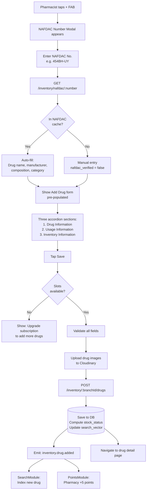
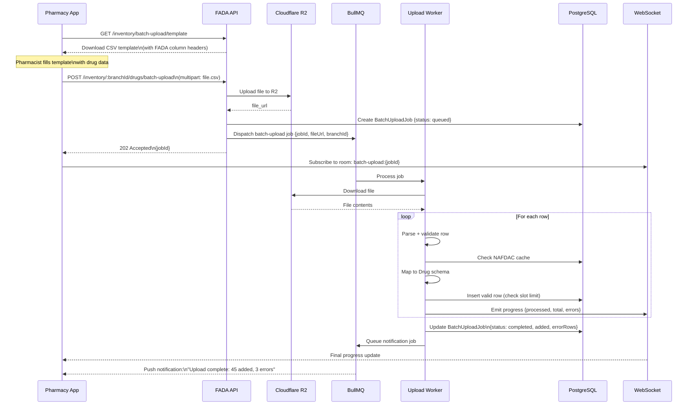
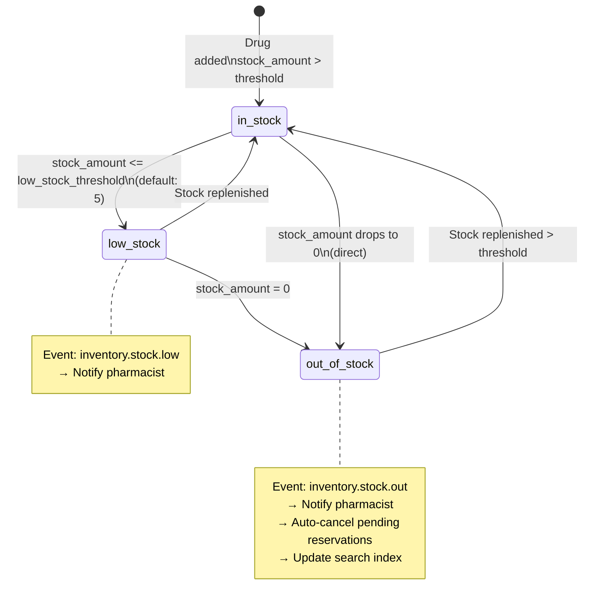

# FADA — Inventory Flow Diagrams

---

## Add Single Drug (NAFDAC-First)



---

## Batch Upload Flow



---

## Stock Management



---

## Inventory Overview Screen Data

```mermaid
flowchart LR
    subgraph Screen [Inventory Screen]
        HEADER[1230 of 2250 slots used\nProgress bar]
        LAST[Last Updated Drug card:\nDate, Name, Type, Price]
        CATS[Category Grid:\nOral Drugs 10\nInfusion Drugs 9\nInjectable Drugs 14\nAntiseptics 21\nOthers 14]
    end

    subgraph API_Calls [API Calls]
        A1[GET /inventory/:branchId/summary\n→ {used, total, lastDrug}]
        A2[GET /inventory/categories\nwith item counts per branch]
    end

    Screen --> API_Calls
```
