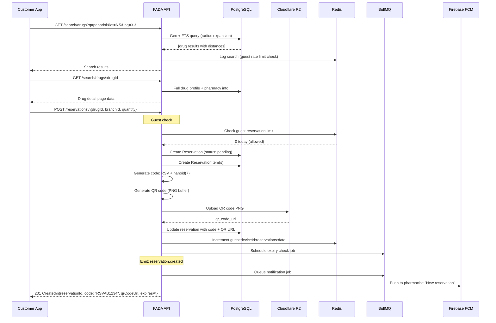
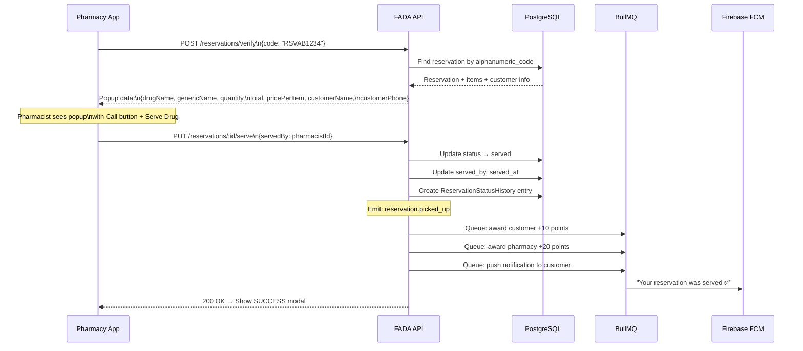
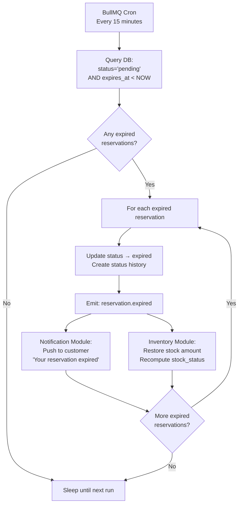
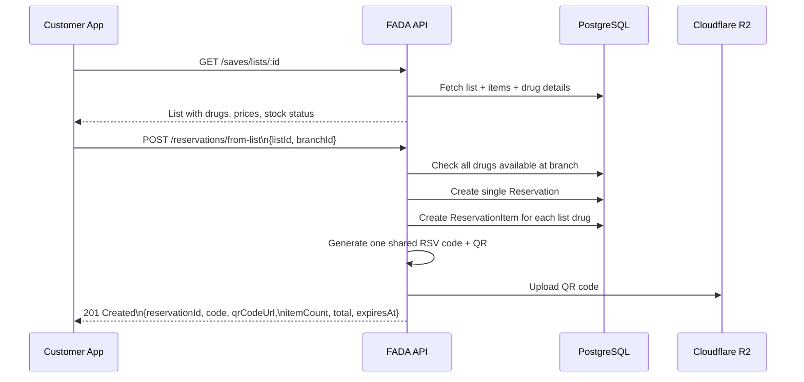
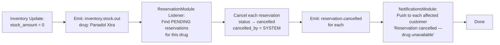

# FADA — Reservation Flow Diagrams

---

## Customer Makes a Reservation

---

## Pharmacist Verifies & Serves Reservation

---

## Reservation Expiry (Cron Job)

---

## Batch Reservation (From Saved List)

---

## Auto-Cancel on Stock Out

