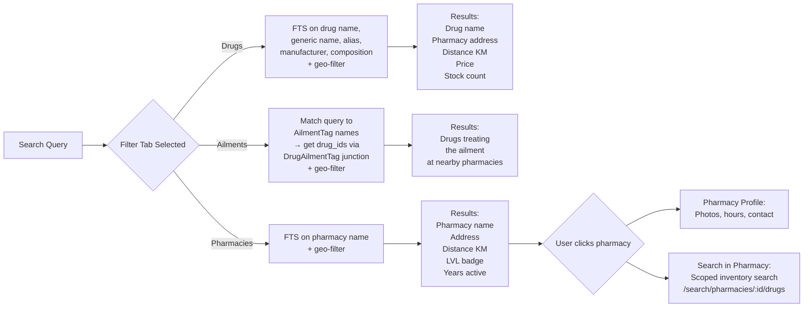
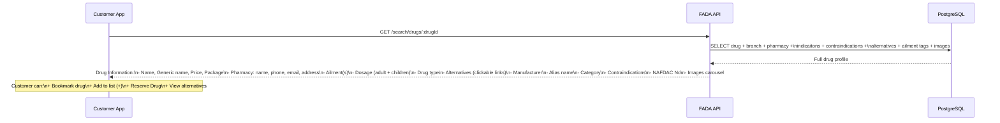
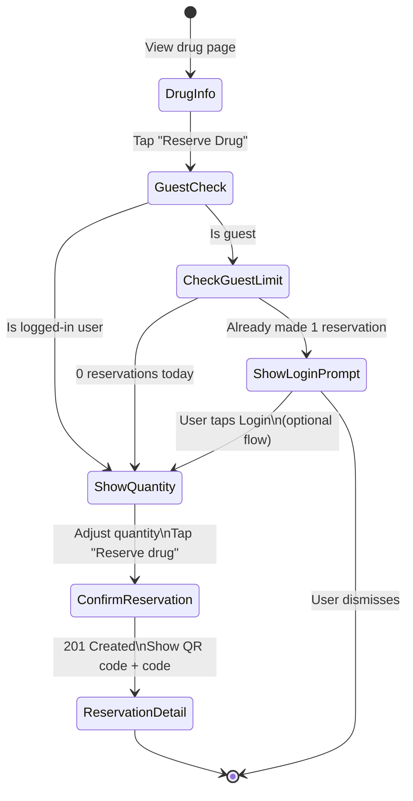

# FADA — Search & Discovery Flow Diagrams

---

## Drug Search with Geo-Fence Expansion

```mermaid
flowchart TD
    REQUEST[GET /search/drugs\n?q=panadol&lat=6.5&lng=3.3] --> GUEST_CHECK

    GUEST_CHECK{Is guest user?}
    GUEST_CHECK -- Yes --> RATE_CHECK
    GUEST_CHECK -- No --> SEARCH

    RATE_CHECK[Redis: Check\nguest:deviceId:searches:date] --> LIMIT_CHECK

    LIMIT_CHECK{Count >= 3?}
    LIMIT_CHECK -- Yes --> BLOCKED[429 Too Many Requests\n'Login to search more']
    LIMIT_CHECK -- No --> INCREMENT

    INCREMENT[Increment guest search counter\nTTL: end of day] --> SEARCH

    SEARCH[Start geo-fenced FTS search] --> R2KM

    R2KM[Try radius = 2km\nPostGIS + tsvector query] --> CHK2

    CHK2{Results found?}
    CHK2 -- Yes --> RETURN
    CHK2 -- No --> R5KM

    R5KM[Expand to 5km] --> CHK5
    CHK5{Results found?}
    CHK5 -- Yes --> RETURN
    CHK5 -- No --> R10KM

    R10KM[Expand to 10km] --> CHK10
    CHK10{Results found?}
    CHK10 -- Yes --> RETURN
    CHK10 -- No --> R20KM

    R20KM[Expand to 20km] --> CHK20
    CHK20{Results found?}
    CHK20 -- Yes --> RETURN
    CHK20 -- No --> R50KM

    R50KM[Expand to 50km] --> CHK50
    CHK50{Results found?}
    CHK50 -- Yes --> RETURN
    CHK50 -- No --> EMPTY[Return empty\nwith suggestion to\ncheck spelling or\nexpand location]

    RETURN[Return results\nwith metadata:\n{results, radiusUsed, total}] --> LOG

    LOG[Log to CustomerSearchHistory\nEmit: search.query.recorded] --> DONE[Response to client]
```

---

## Search Result Types



---

## Drug Information Page (Customer)



---

## Reserve from Search (with Guest Prompt)


