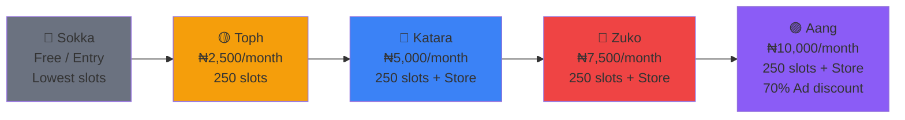
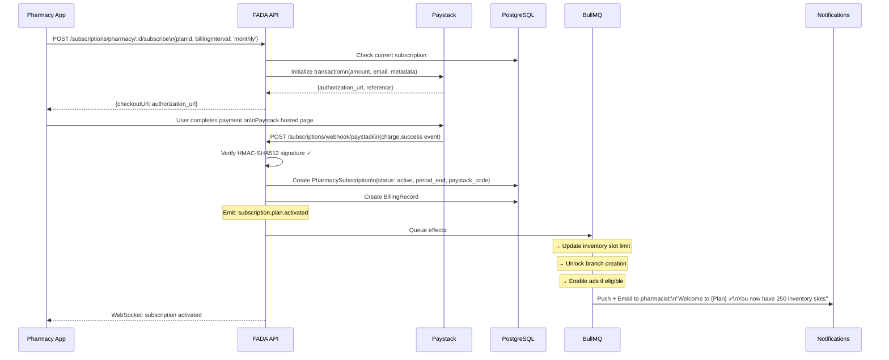
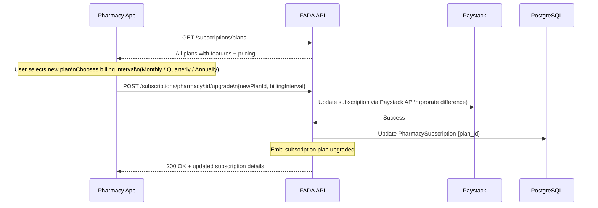
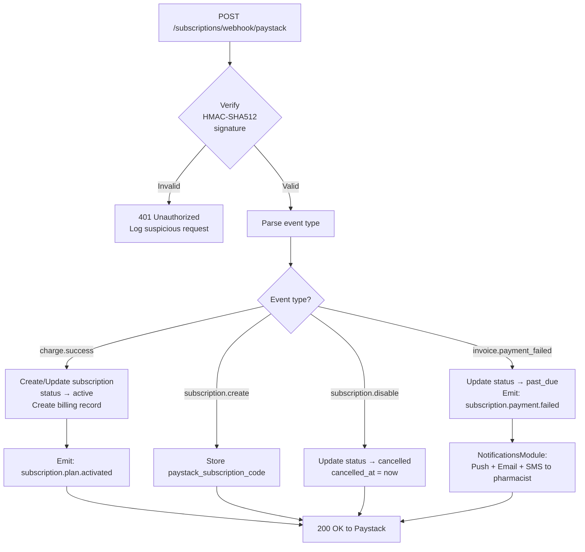

# FADA — Subscription & Payment Flow

---

## Subscription Plans

```mermaid
graph LR
    SOKKA[🔵 Sokka\nFree / Entry\nLowest slots]
    TOPH[🟡 Toph\n₦2,500/month\n250 slots]
    KATARA[🔵 Katara\n₦5,000/month\n250 slots + Store]
    ZUKO[🔴 Zuko\n₦7,500/month\n250 slots + Store]
    AANG[🟣 Aang\n₦10,000/month\n250 slots + Store\n70% Ad discount]

    SOKKA --> TOPH --> KATARA --> ZUKO --> AANG

    style SOKKA fill:#6b7280
    style TOPH fill:#f59e0b
    style KATARA fill:#3b82f6
    style ZUKO fill:#ef4444
    style AANG fill:#8b5cf6
```

---

## Subscription Initiation (Paystack)

```mermaid
sequenceDiagram
    participant PA as Pharmacy App
    participant API as FADA API
    participant PST as Paystack
    participant DB as PostgreSQL
    participant BQ as BullMQ
    participant NOT as Notifications

    PA->>API: POST /subscriptions/pharmacy/:id/subscribe\n{planId, billingInterval: 'monthly'}
    API->>DB: Check current subscription
    API->>PST: Initialize transaction\n(amount, email, metadata)
    PST-->>API: {authorization_url, reference}
    API-->>PA: {checkoutUrl: authorization_url}

    PA->>PST: User completes payment on\nPaystack hosted page

    PST->>API: POST /subscriptions/webhook/paystack\n(charge.success event)
    API->>API: Verify HMAC-SHA512 signature ✓
    API->>DB: Create PharmacySubscription\n{status: active, period_end, paystack_code}
    API->>DB: Create BillingRecord

    Note over API: Emit: subscription.plan.activated

    API->>BQ: Queue effects:
    Note over BQ: → Update inventory slot limit
    Note over BQ: → Unlock branch creation
    Note over BQ: → Enable ads if eligible

    BQ->>NOT: Push + Email to pharmacist:\n"Welcome to {Plan} ✅\nYou now have 250 inventory slots"

    API-->>PA: WebSocket: subscription activated
```

---

## Plan Upgrade Flow

```mermaid
sequenceDiagram
    participant PA as Pharmacy App
    participant API as FADA API
    participant PST as Paystack
    participant DB as PostgreSQL

    PA->>API: GET /subscriptions/plans
    API-->>PA: All plans with features + pricing

    Note over PA: User selects new plan\nChooses billing interval\n(Monthly / Quarterly / Annually)

    PA->>API: POST /subscriptions/pharmacy/:id/upgrade\n{newPlanId, billingInterval}
    API->>PST: Update subscription via Paystack API\n(prorate difference)
    PST-->>API: Success

    API->>DB: Update PharmacySubscription {plan_id}
    Note over API: Emit: subscription.plan.upgraded

    API-->>PA: 200 OK + updated subscription details
```

---

## Webhook Event Handling

```mermaid
flowchart TD
    WEBHOOK[POST /subscriptions/webhook/paystack] --> VERIFY

    VERIFY{Verify\nHMAC-SHA512\nsignature}
    VERIFY -- Invalid --> REJECT[401 Unauthorized\nLog suspicious request]
    VERIFY -- Valid --> PARSE[Parse event type]

    PARSE --> TYPE{Event type?}

    TYPE -- charge.success --> ACTIVATE[Create/Update subscription\nstatus → active\nCreate billing record]
    TYPE -- subscription.create --> STORE[Store paystack_subscription_code]
    TYPE -- subscription.disable --> CANCEL[Update status → cancelled\ncancelled_at = now]
    TYPE -- invoice.payment_failed --> FAIL[Update status → past_due\nEmit: subscription.payment.failed]

    ACTIVATE --> EMIT_ACT[Emit: subscription.plan.activated]
    FAIL --> NOTIFY[NotificationsModule:\nPush + Email + SMS to pharmacist]

    EMIT_ACT --> OK[200 OK to Paystack]
    STORE --> OK
    CANCEL --> OK
    NOTIFY --> OK
```
