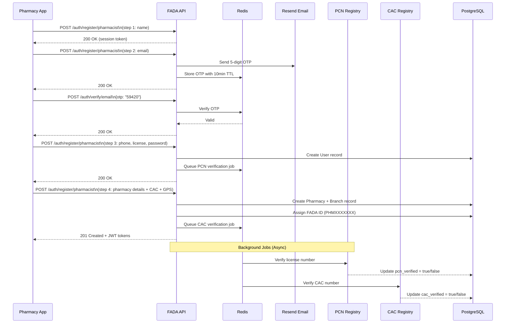
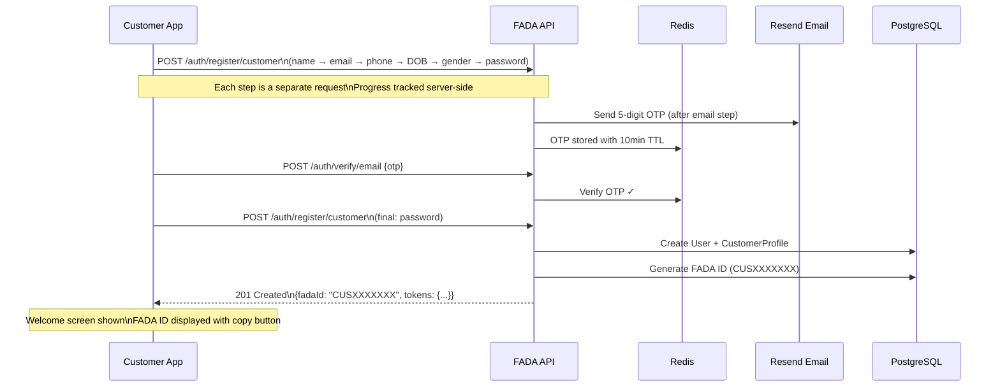

# FADA — System Overview Diagram

```mermaid
graph TB
    subgraph Clients
        PA[Pharmacy App\nFlutter]
        CA[Customer App\nFlutter]
    end

    subgraph FADA_Backend [FADA Backend - NestJS Modular Monolith]
        direction TB

        subgraph API_Layer [API Layer]
            GW[API Gateway\nREST + WebSocket]
        end

        subgraph Core_Modules [Core Modules]
            AUTH[Auth Module]
            PHM[Pharmacy Module]
            INV[Inventory Module]
            SRC[Search Module]
            RES[Reservation Module]
        end

        subgraph Business_Modules [Business Modules]
            SUB[Subscription Module]
            ADS[Ads Module]
            PTS[Points Module]
            SAV[Saves Module]
            CPR[Customer Profile Module]
        end

        subgraph Platform_Modules [Platform Modules]
            NOT[Notifications Module]
            ANA[Analytics Module]
            SUP[Support Module]
            CNT[Content Module]
            FFG[Feature Flags Module]
        end

        EVT((Internal\nEvent Bus))

        Core_Modules <--> EVT
        Business_Modules <--> EVT
        Platform_Modules <--> EVT
    end

    subgraph Infrastructure [Infrastructure Layer]
        PG[(PostgreSQL\n+ PostGIS)]
        RD[(Redis\nCache + Queue)]
        BQ[BullMQ\nWorkers]
        SK[Socket.IO\nGateway]
    end

    subgraph External_Services [External Services]
        PST[Paystack]
        FLW[Flutterwave]
        FCM[Firebase FCM]
        TRM[Termii SMS]
        RSN[Resend Email]
        R2[Cloudflare R2]
        CDN[Cloudinary]
        PCN[PCN Registry]
        CAC[CAC Registry]
        NAFDAC[NAFDAC Registry]
    end

    PA --> GW
    CA --> GW
    GW --> Core_Modules
    GW --> Business_Modules
    GW --> Platform_Modules

    Core_Modules --> PG
    Business_Modules --> PG
    Platform_Modules --> PG
    Core_Modules --> RD
    Business_Modules --> RD
    RD --> BQ

    NOT --> FCM
    NOT --> TRM
    NOT --> RSN
    SUB --> PST
    SUB --> FLW
    INV --> R2
    INV --> CDN
    PHM --> PCN
    PHM --> CAC
    INV --> NAFDAC
    SK --> RD
```

---

# Registration Flow — Pharmacist

```mermaid
sequenceDiagram
    participant App as Pharmacy App
    participant API as FADA API
    participant Redis as Redis
    participant Email as Resend Email
    participant PCN as PCN Registry
    participant CAC as CAC Registry
    participant DB as PostgreSQL

    App->>API: POST /auth/register/pharmacist\n(step 1: name)
    API-->>App: 200 OK (session token)

    App->>API: POST /auth/register/pharmacist\n(step 2: email)
    API->>Email: Send 5-digit OTP
    API->>Redis: Store OTP with 10min TTL
    API-->>App: 200 OK

    App->>API: POST /auth/verify/email\n{otp: "59420"}
    API->>Redis: Verify OTP
    Redis-->>API: Valid
    API-->>App: 200 OK

    App->>API: POST /auth/register/pharmacist\n(step 3: phone, license, password)
    API->>DB: Create User record
    API->>Redis: Queue PCN verification job
    API-->>App: 200 OK

    App->>API: POST /auth/register/pharmacist\n(step 4: pharmacy details + CAC + GPS)
    API->>DB: Create Pharmacy + Branch record
    API->>DB: Assign FADA ID (PHMXXXXXXX)
    API->>Redis: Queue CAC verification job
    API-->>App: 201 Created + JWT tokens

    Note over API,PCN: Background Jobs (Async)
    Redis->>PCN: Verify license number
    PCN-->>DB: Update pcn_verified = true/false

    Redis->>CAC: Verify CAC number
    CAC-->>DB: Update cac_verified = true/false
```

---

# Registration Flow — Customer

```mermaid
sequenceDiagram
    participant App as Customer App
    participant API as FADA API
    participant Redis as Redis
    participant Email as Resend Email
    participant DB as PostgreSQL

    App->>API: POST /auth/register/customer\n(name → email → phone → DOB → gender → password)
    Note over App,API: Each step is a separate request\nProgress tracked server-side

    API->>Email: Send 5-digit OTP (after email step)
    API->>Redis: OTP stored with 10min TTL

    App->>API: POST /auth/verify/email {otp}
    API->>Redis: Verify OTP ✓

    App->>API: POST /auth/register/customer\n(final: password)
    API->>DB: Create User + CustomerProfile
    API->>DB: Generate FADA ID (CUSXXXXXXX)
    API-->>App: 201 Created\n{fadaId: "CUSXXXXXXX", tokens: {...}}

    Note over App: Welcome screen shown\nFADA ID displayed with copy button
```
